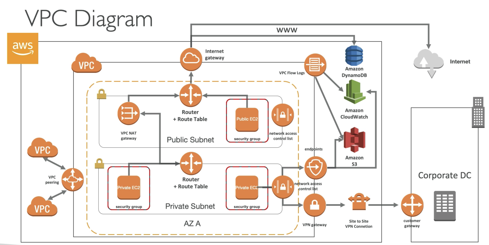
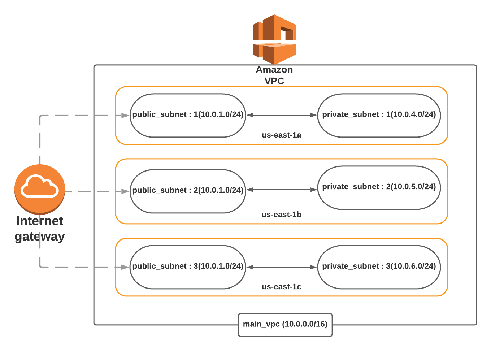

# VPC (Virtual Private Cloud/Network)

## VPC
VPC isolates the instances on a network level.
 - It is like your own private network.

Best Practice is to always launch your instance in a VPC.
 - the default VPC
 - or your create one using terraform

**Note:** There is also EC2-Classic, which is basically one big network where all AWS customers could launch their instances in it is one big network but the best practice is to launch the instances in your own VPC.

An instance launched in one VPC can never communicate with an instance in another VPC using their **private IP address**.
- They could communicate still, but using their public IP (not recommended)

### <ins> VPC Peering </ins>
Is the VPC component of VPC that links 2 VPCs together. And you can make your resources to talk to each other like they are in the same VPC.

### <ins> Simple VPC Diagram </ins>

- We will Create our own VPC to deploy the instances.
- This uses the CIDR range of **10.0.0.0/16** which is 65000 ips
- We will create our VPC in us-east-1. The Virginia Region.
- Every Availability Zone will have it is own **public** and **private subents**.
- Each Subent will have the CIDR range of 10.0.1.x which is around 256 ips in our case.
- CIDR ranges should not overlap.
- All the Public Subnets will be connected to the **Internet Gateway**. and the instances that are launched in the public subnet will have an public IP that will make them reachable from the internet.
- Instances launched in the **pirvate subnet will not have an Public IP** so they won be rachable from the internet.
- Instances in the same VPC can talk to each other with the private IP since they are in the same VPC.

**NOTE:**
- Use Public Subnets for the Internet facing services/applications
- Use Private Subents for backends, databases and caching services all goes into private subnets.
- If you use Load Balancer you will put LB into Public Subnets but the instances in a private Subnets.